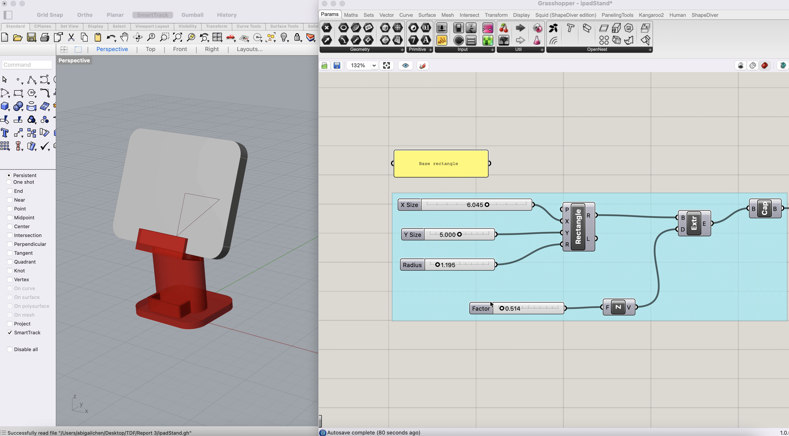

- [TDF Wiki](https://github.com/Berkeley-MDes/desinv-202/wiki) - the ultimate source for truth and information about the course and assignments

---

 # 💡 Report 9 - Week of 10/26/23
## Abigail Chen, Technology Design Foundations

This week, I have been diving deep into design competitions and conferences. Recently, I discovered these two:

- International Design Awards
- Ars Electronica

## International Design Awards

International Design Awards (IDA) is a design competition that accepts submissions from all over the world in basically any category imaginable. It's pretty incredible. I am planning to submit my Hydropoonics project that I completed in my Studio course and see how that does! 

## Ars Electronica

Ars Electronica is one of the biggest media arts conferences. Its focus is to highlight engaging projects in a few categories, such as New Animation Art, AI & Life Art, Music and Sound Art. Going through the projects has been incredibly inspiring and has honestly made me want to dive deeper into this space of media art/installations. 

---

 # 💡 Report 9 - Week of 10/26/23
## Abigail Chen, Technology Design Foundations

This week, after an assigned reading in my Tangible User Interfaces class, I started reading _Speculative Everything: Design, Fiction, and Social Dreaming_ by Anthony Dunne and Fiona Raby.

## 💭 Key Takeaways So Far
- Speculative design aims to provoke and create imaginary realities that could happen in the future.
- Speculative design is well suited for several fields, such as architecture, furniture design, and automotive design. However, it is **not** well-suited for product design. Product design remains closely aligned with market esxpectation and is one of the few areas in which conceptual and commercial approaches really do not mix.
- Rather than seek out market gaps for new products, designers should work independently of industry, in partnership with organizations focused on society in the broadest sense, not just business. Designers should use their time for more civic purposes. Universities should become platforms for experimentation, speculation, and the reimagining of everyday life.
- Speculative design and art differ in that design touches closely upon the everyday life. If it's weird, people can brush it off as art. If it touches their everyday life like speculative design does, they are forced to think about it.
- Marcel Duchamp was considered the first true conceptual artist.

---

 # 💡 Report 8 - Week of 10/12/23
## Abigail Chen, Technology Design Foundations

This week, we finished our prototype and created our video!

Watch it [here!](https://www.youtube.com/watch?v=M70af7eBjBw)

--- 

 # 💡 Report 7 - Week of 10/12/23
## Abigail Chen, Technology Design Foundations

## 📎 Description

This week, I received the Neopixel Ring! During class today, I plan on testing it out with the Photon to test different lighting systems. 

 

---

 # 💡 Report 6 - Week of 10/05/23
## Abigail Chen, Technology Design Foundations

## 📎 Description

This week, my TDF group and I got together to write our Project Specs in [this doc](https://docs.google.com/document/d/1Q6KBJUg6nhvs-IQsDCxjO8rSfnwr_xWBTeFlMxlDzE0/edit?usp=sharing)!

## ➡️ Next Steps

For next steps, I will be in charge of looking into lighting options for our project. Currently, we are considering the following: 
- Neopixels
- nOODS flexible lighting

---

 # 💡 Report 5 - Week of 9/28/23
## Abigail Chen, Technology Design Foundations

## 📎 Description

This week, we each chose and ranked our favorite projects ideas. 
I was placed in the **Laser Chime ** group! We plan to create a wind chime and replace the chimes with lasers!!
We are also thinking of scaling our idea up to a human-sized art installation, in which you become the striker in the middle and can create audio and visual feedback by hitting certain areas.

## ➡️ Next Steps 

Our next steps will be to meet as a group next week to discuss buying sensors! 

 ---

 # 💡 Report 4 - Week of 09/21/23
## Abigail Chen, Technology Design Foundations

## 📎 Description

This week, I got set up with my Particle Photon 2 microcontroller! 

The process was fairly simple. I followed Sudhu's instructions on how to get set up, which were the following:
1. Initial Setup. I named my device **sexy_micro**
2. Configure Wi-Fi
3. Get Mac Address
4. Register Mac Address with Berkeley IoT

I had some trouble with the initial connection since I first tried conneting my Photon to an Adapter plugged into my laptop via USB-C, pictured below. 

However, my Photon wasn't showing up, so I checked the TDF Slack and found that a classmate was having the exact same issue. I messaged her, and she graciously told me to plug my Photon directly into my laptop via the USB C cable that came with our kit!

 

## ➡️ Next Steps

For our class tomorrow, hopefully we'll be using and tinkering around with **sexy_micro**! I can't wait. 

---

 # 💡 Report 3 - Week of 09/14/23
## Abigail Chen, Technology Design Foundations

## 📎 Description

This year, I recently bought an iPad Pro for school. Unfortunately, I haven't gotten around to buying an iPad stand, so that it can be a part of my **triple** monitor setup at home (very useful when using Rhino and Grasshopper). But no worries! I can **BUILD** my own iPad stand with the skills that I've learned in TDF!! 

## 🔍 Research

I began my research portion of this assignment by browsing the Interwebs of existing iPad stand models to use as inspiration. I stumbled upon a few models on Cults, a 3D printing marketplace that allows makers to share free and paid models meant for 3D printing (it's also a social network for 3D printing enthusiasts!) Two, in particular, caught my eye. 

### [iPad Stand 1️⃣](https://cults3d.com/en/3d-model/gadget/ipad-stand-juribe2)

iPad Stand 1 seemed like a really nice standard mdoel. However, as a novice, I was a bit befuddled at how to create the geometries that would go into this, especially the curve and the volumes to create the gaps in the model. 

### [iPad Stand 2️⃣](https://cults3d.com/en/3d-model/gadget/tablet-stand-for-ipad-pro-with-options)

This model I really enjoyed first of all because it has an AirPods holder! This is definitely something that I need for my desk as I often misplace my AirPods (I've lost two AirPods/cases before. I'm on my third. Wish me luck). Also, this model included a screenshot of the model in the software, which would help when designing. 

#### Winner: iPad Stand 2! 🥳 

## 🏛️ Modeling

## ➡️ Future Considerations

For my final submission, I would like to tweak the parametrics of my Grasshopper file, so that the iPad stand will adjust dynamically to changes of the iPad. I also want to print and see how it turns out! 

Check out my video [here](https://www.youtube.com/watch?v=OEmV8QkV3yI)!

---

# 💡 Report 2 - Week of 09/07/23
## Abigail Chen, Technology Design Foundations

## 📎 Description

This week, I watched TJ's video tutorial titled "Cell Phone Stand Design, Evaluation, and Publication" and worked off of it to create a 3D-printable phone stand customized to the parameters of my own phone, using the same parameters as the previous report. 

## 🧠 What I Learned
- I **finally** learned the syntax of naming in Grasshopper. In the gray rectangles, the first word is what it represents, and everything following that is the name customized by the user.
- I also **finally** learned what Brep means. Boundary representation!!! Brep rep!!
- I learned how to create models from scratch using parametric modeling.
- I learned how to check if a model is stable and how to implement a color-coding system to determine this

### 📷 My Model!

### 🤔 Important Questions to Ask Before Baking
- Is the model stable?
- Do any sections of the model seem too thin or easily breakable when printed?
- Is there unnecessary volume that can be removed before printing to reduce waste? 

## 💭 Takeaways
This tutorial helped me better understand the power of computational design and parametric modeling. As a designer who has only 3D modeled from scratch in software like Cinema 4D and Blender, this was my first time designing for scalable designs computationally. This is an extremely powerful tool that allows designers to include the decisions that they care about in the tool where they're making the decisions. No more redesigning your entire model if its position changes. No more finnicking with tiny details that will end up having to be changed. I also appreciate the open source spirit of ShapeDiver, the cloud application for Grasshopper. Anyone with access to the Internet can play with these models! Everyone gets a model! 

## ➡️ Future Considerations
In the future, I can 3D print the model that I designed today and test it further to see how this design works physically. Getting my hands dirty and simply printing something will be very exciting and help me improve for my next iteration!

---

# 💡 Report 1 - Week of 08/28/23
## Abigail Chen, Technology Design Foundations

## 📎 Description

✨📱 This week, I designed a cool phone stand. 

I played around with the Rhino sliders and adjusted the following parameters:

🔺 phone width: 77mm

🔺 phone length: 153 mm

🔺 phone depth: 22.6 mm (my phone is quite phat because it has a cardholder with several cards) 

🔺 material width: 3mm 

I chose acrylic as my material because I think it looks cool, and it was the only thick scrap material that I could find.

## :bug: The nasty bugs I encountered and how I fixed them!
1. **Weird Bugs**
   
   Whenever I closed the control panel, Grasshopper would start tweaking and throw a Display Error that evilly forced me to quit the program. This turned out to be a strange Mac bug that I solved with the classic Restart.
3. **Perspective**
   
   The first time I tried baking my model, I baked at the wrong perspective and got an angled bake. Oops! I solved this by switching to top view (Cody said that in all his 17 years of using Rhino he has only ever used Top, Perspective, and 4Views).
5. **Baking**
   
   I forgot to change the default bake scale, so my first bake was **way** too small. After this, I changed the scale to 1:1.
   The second baking challenge (This feels like the Great British Bake-Off) was that after I baked to an Illustrator file, I would open the file to a blank page. This was because my model was not centered in Rhino and thus when converted to Illustrator it was **way** too far off of the artboard to be seen. To solve this, I used the Move command in Rhino and moved my model to 0.

## 📷 Photos

Depiction of The Triumph of Successful Laser Cutting (2023, colorized) 💖

