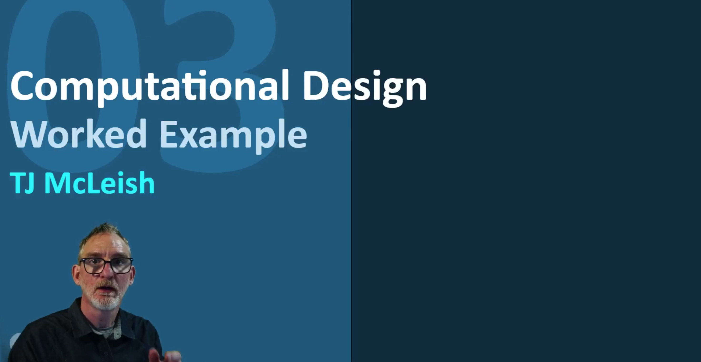

## Quick Links ##

- [TDF Wiki](https://github.com/Berkeley-MDes/desinv-202/wiki) - the ultimate source for truth and information about the course and assignments
- [Google Drive Folder](https://drive.google.com/drive/folders/1OjFgu4llHn-2WayQFVWRKFyOkQ_WaQRx?usp=drive_link) - slides and other resources
- [bCourses](https://bcourses.berkeley.edu/courses/1528355) - where the grading happens

 ---
 
# 💡 Report 1 - Week of 08/28/23
## Abigail Chen, Technology Design Foundations

## 📎 Description

✨📱 This week, I designed a cool phone stand. 

I played around with the Rhino sliders and adjusted the following parameters:

🔺 phone width: 77mm

🔺 phone length: 153 mm

🔺 phone depth: 22.6 mm (my phone is quite phat because it has a cardholder with several cards) 

🔺 material width: 3mm 

I chose acrylic as my material because I think it looks cool, and it was the only thick scrap material that I could find.

## :bug: The nasty bugs I encountered and how I fixed them!
1. **Weird Bugs**
   
   Whenever I closed the control panel, Grasshopper would start tweaking and throw a Display Error that evilly forced me to quit the program. This turned out to be a strange Mac bug that I solved with the classic Restart.
3. **Perspective**
   
   The first time I tried baking my model, I baked at the wrong perspective and got an angled bake. Oops! I solved this by switching to top view (Cody said that in all his 17 years of using Rhino he has only ever used Top, Perspective, and 4Views).
5. **Baking**
   
   I forgot to change the default bake scale, so my first bake was **way** too small. After this, I changed the scale to 1:1.
   The second baking challenge (This feels like the Great British Bake-Off) was that after I baked to an Illustrator file, I would open the file to a blank page. This was because my model was not centered in Rhino and thus when converted to Illustrator it was **way** too far off of the artboard to be seen. To solve this, I used the Move command in Rhino and moved my model to 0.

## 📷 Photos

Depiction of The Triumph of Successful Laser Cutting (2023, colorized) 💖

---

# 💡 Report 2 - Week of 09/07/23
## Abigail Chen, Technology Design Foundations

## 📎 Description

This week, I watched TJ's video tutorial titled "Cell Phone Stand Design, Evaluation, and Publication" and worked off of it to create a 3D-printable phone stand customized to the parameters of my own phone, using the same parameters as the previous report. 

## 🧠 What I Learned
- I **finally** learned the syntax of naming in Grasshopper. In the gray rectangles, the first word is what it represents, and everything following that is the name customized by the user.
- I also **finally** learned what Brep means. Boundary representation!!! Brep rep!!
- I learned how to create models from scratch using parametric modeling.
- I learned how to check if a model is stable and how to implement a color-coding system to determine this

### 📷 My Model!

### 🤔 Important Questions to Ask Before Baking
- Is the model stable?
- Do any sections of the model seem too thin or easily breakable when printed?
- Is there unnecessary volume that can be removed before printing to reduce waste? 

## 💭 Takeaways
This tutorial helped me better understand the power of computational design and parametric modeling. As a designer who has only 3D modeled from scratch in software like Cinema 4D and Blender, this was my first time designing for scalable designs computationally. This is an extremely powerful tool that allows designers to include the decisions that they care about in the tool where they're making the decisions. No more redesigning your entire model if its position changes. No more finnicking with tiny details that will end up having to be changed. I also appreciate the open source spirit of ShapeDiver, the cloud application for Grasshopper. Anyone with access to the Internet can play with these models! Everyone gets a model! 

## ➡️ Future Considerations
In the future, I can 3D print the model that I designed today and test it further to see how this design works physically. Getting my hands dirty and simply printing something will be very exciting and help me improve for my next iteration!

